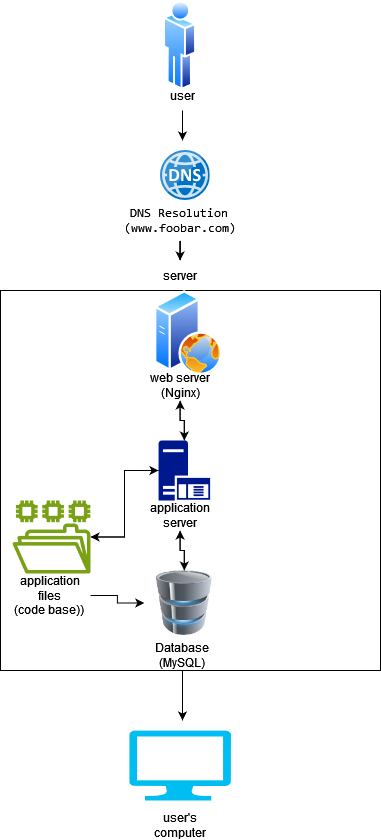

# Simple Web Stack

## DESCRIPTION
It is a simple web infrastructure that hosts a website that is reachable via www.foobar.com. It doesnt contain firewalls or SSL certificates for protecting the server's network and each component (database, application server) has to share the resources (CPU, RAM, and SSD) provided by the server.

## HOW IT WORKS

### 1. User Accessing www.foobar.com:

a. User Request:
   + The process begins when a user types www.foobar.com in their web browser or clicks a link to the site.

b. DNS Resolution:
   + The user's request involves DNS resolution to translate the human-readable domain name (www.foobar.com) into an IP address.
   + The www record in www.foobar.com specifies the hostname, indicating that the user wants to access the web service associated with the domain.

c. DNS Record Type:
   + The DNS record type for www.foobar.com is typically an A record, mapping the domain to an IPv4 address. This ensures that www.foobar.com points to the server's IP address (e.g., 8.8.8.8).

### 2. Server Infrastructure:
a. Server (8.8.8.8):

   + This is the physical or virtual machine that hosts the entire web infrastructure.

b. Web Server (Nginx):

   + Nginx serves as the web server. It handles HTTP requests, manages static content delivery, and can act as a reverse proxy to the application server.

c. Application Server:

   + The application server runs your code base. It interprets and executes the application logic, generating dynamic content based on user requests.

d. Application Files (Code Base):

   + Your application code and files reside on the server. These files are executed by the application server to generate dynamic content.

e. Database (MySQL):

   + MySQL is used as the database to store and manage the website's data. The application server communicates with the database to retrieve or update information.

f. Communication with User's Computer:

   + The server communicates with the user's computer over the Internet using the HTTP or HTTPS protocol.

### Specifics about the Infrastructure:

a. Server Role:
  + A server is a computer or system that provides services or resources to other computers, known as clients, over a network.

b. Domain Name Role:
  + A domain name (www.foobar.com) provides a human-readable reference to the server's IP address. It is crucial for users to access the website easily.

c. www DNS Record:
  + The www record in www.foobar.com is typically an A record, specifying the IP address associated with the hostname.

d. Web Server Role:
  + Nginx acts as the web server, handling incoming HTTP requests, serving static content, and potentially acting as a reverse proxy.

e. Application Server Role:
  + The application server executes your code base, generating dynamic content based on user requests.

f. Database Role:

  + MySQL serves as the database, storing and managing the website's data. The application server communicates with the database as needed.

### Issues with the Infrastructure:

1. Single Point of Failure (SPOF):
    + The entire infrastructure relies on a single server and If this server goes down, the entire website becomes inaccessible. Consider redundancy and failover strategies to mitigate this risk.

2. Downtime during Maintenance:
    + When performing maintenance, such as deploying new code that requires restarting the web server, the website may experience downtime. Consider implementing a rolling deployment strategy or using redundant servers to avoid complete downtime.

3. Limited Scalability:
    + With only one server, the infrastructure may struggle to handle a significant increase in incoming traffic. Consider implementing load balancing and scaling strategies for improved performance and availability.
